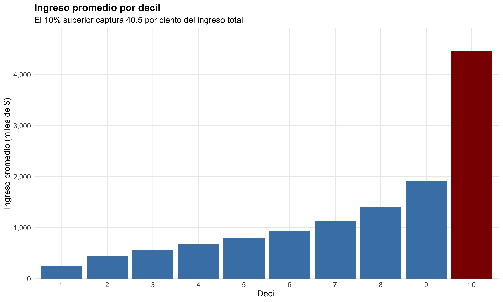

```{r setup, include=FALSE}
knitr::opts_chunk$set(
  echo = FALSE,
  message = FALSE,
  warning = FALSE,
  fig.width = 10,
  fig.height = 6,
  dpi = 300
)

source("setup.R")
check_data()

library(haven)
library(dplyr)
library(ggplot2)
library(scales)
library(kableExtra)
library(purrr)
```

Cargar datos

```{r}
casen <- readRDS(ruta_casen)
ebs <- read_sav(ruta_ebs)

# Ver qué variables tenemos disponibles
# print(names(casen))
# print(names(ebs))

# Calcular deciles y crear variable top10 en CASEN
casen <- casen %>%
  mutate(
    decil = ntile(ytotcorh, 10),
    top10 = ifelse(decil == 10, 1, 0)
  ) %>%
  rename(
    folio_casen = folio,
    id_persona_casen = id_persona
  )

# Realizar el merge manteniendo todas las variables
merged_data <- merge(
  casen,  # Mantenemos todas las variables de CASEN
  ebs %>% select(folio_casen, id_persona_casen, fexp, region),  # Seleccionamos solo las variables necesarias de EBS
  by = c("folio_casen", "id_persona_casen"),
  suffixes = c("_casen", "_ebs")  # Para diferenciar variables duplicadas
)

```

Estadísticas por decil
```{r}
stats_deciles <- merged_data %>%
  group_by(decil) %>%
  summarise(
    n = n(),
    n_expandido = sum(fexp),
    ingreso_medio = weighted.mean(ytotcorh, fexp, na.rm = TRUE),
    proporcion_poblacion = sum(fexp)/sum(merged_data$fexp)
  )

# Formatear y presentar tabla
stats_deciles %>%
  kbl(caption = "Estadísticas por decil de ingreso") %>%
  kable_styling(bootstrap_options = c("striped", "hover"))
```

Gráfico

```{r}
# Calcular proporción del ingreso del 10% superior
total_income_weighted <- sum(merged_data$ytotcorh * merged_data$fexp, na.rm = TRUE)
top10_income_weighted <- sum(merged_data$ytotcorh[merged_data$top10 == 1] * 
                           merged_data$fexp[merged_data$top10 == 1], na.rm = TRUE)

# Formatear datos para el gráfico
stats_deciles$ingreso_medio_miles <- stats_deciles$ingreso_medio/1000

# Crear el gráfico
p <- ggplot(stats_deciles, aes(x = factor(decil), y = ingreso_medio_miles)) +
  geom_bar(stat = "identity", fill = "steelblue") +
  geom_bar(data = subset(stats_deciles, decil == 10), 
           aes(x = factor(decil), y = ingreso_medio_miles),
           fill = "darkred", 
           stat = "identity") +
  scale_y_continuous(
    labels = function(x) format(x, big.mark = ",", scientific = FALSE),
    expand = expansion(mult = c(0, 0.1))
  ) +
  labs(
    title = "Ingreso promedio por decil",
    subtitle = paste("El 10% superior captura", 
                    format(round(top10_income_weighted/total_income_weighted*100, 1), 
                           nsmall = 1),
                    "por ciento del ingreso total"),
    x = "Decil",
    y = "Ingreso promedio (miles de $)"
  ) +
  theme_minimal() +
  theme(
    plot.title = element_text(face = "bold", size = 14),
    plot.subtitle = element_text(size = 12),
    axis.title = element_text(size = 12),
    axis.text = element_text(size = 10),
    panel.grid.minor = element_blank()
  )

# Guardar y mostrar el gráfico
if (!dir.exists("outputs")) dir.create("outputs")
jpeg(filename = "outputs/grafico_deciles.jpg",
     width = 10, height = 6, 
     units = "in", res = 300)
print(p)
dev.off()


```

```{r}
# Variable dummy para el 10% superior
merged_data <- merged_data %>%
  mutate(
    elite = ifelse(decil == 10, 1, 0),
    elite_label = factor(ifelse(decil == 10, "10% superior", "Resto"))
  )

# Análisis descriptivo por grupo
stats_descriptivos <- merged_data %>%
  group_by(elite_label) %>%
  summarise(
    n = n(),
    n_expandido = sum(fexp),
    ingreso_promedio = round(weighted.mean(ytotcorh, fexp, na.rm = TRUE)),
    desv_est = round(sqrt(weighted.mean((ytotcorh - weighted.mean(ytotcorh, fexp))^2, fexp))),
    edad_promedio = weighted.mean(edad, fexp, na.rm = TRUE),
    prop_hombres = weighted.mean(sexo == 1, fexp, na.rm = TRUE),
    prop_urbano = weighted.mean(zona == 1, fexp, na.rm = TRUE)
  ) %>%
  mutate(
    prop_muestra = n/sum(n),
    prop_poblacion = n_expandido/sum(n_expandido)
  )

# Mostrar tabla de estadísticas descriptivas
stats_descriptivos %>%
  kbl(caption = "Características del 10% superior vs resto", 
      digits = 2,
      format.args = list(big.mark = ",")) %>%
  kable_styling(bootstrap_options = c("striped", "hover"))
```


Análisis por región
```{r}
nombres_regiones <- c(
  "15" = "Arica y Parinacota",
  "1" = "Tarapacá",
  "2" = "Antofagasta",
  "3" = "Atacama",
  "4" = "Coquimbo",
  "5" = "Valparaíso",
  "13" = "Metropolitana",
  "6" = "O'Higgins",
  "7" = "Maule",
  "8" = "Biobío",
  "16" = "Ñuble",
  "9" = "Araucanía",
  "14" = "Los Ríos",
  "10" = "Los Lagos",
  "11" = "Aysén",
  "12" = "Magallanes"
)

# Recodificar la variable región manteniendo el orden norte-sur
merged_data <- merged_data %>%
  mutate(
    region_nombre = factor(region,
                          levels = c("15", "1", "2", "3", "4", "5", "13", "6", 
                                   "7", "8", "16", "9", "14", "10", "11", "12"),
                          labels = nombres_regiones[c("15", "1", "2", "3", "4", "5", "13", "6", 
                                                    "7", "8", "16", "9", "14", "10", "11", "12")],
                          ordered = TRUE)  # Hacer que sea un factor ordenado
  )

# Actualizar el análisis por región usando el nuevo orden
stats_region <- merged_data %>%
  group_by(region_nombre) %>%
  summarise(
    n = n(),
    prop_elite = weighted.mean(elite, fexp, na.rm = TRUE),
    ingreso_medio = weighted.mean(ytotcorh, fexp, na.rm = TRUE)
  ) %>%
  mutate(
    prop_elite = scales::percent(prop_elite, accuracy = 0.1),
    ingreso_medio = scales::comma(ingreso_medio, accuracy = 1)
  )

# Mostrar tabla ordenada y formateada
stats_region %>%
  kbl(caption = "Distribución del 10% superior por región (ordenado de norte a sur)",
      col.names = c("Región", "N", "Proporción Elite", "Ingreso Medio"),
      align = c('l', 'r', 'r', 'r')) %>%
  kable_styling(bootstrap_options = c("striped", "hover")) %>%
  row_spec(0, bold = TRUE)

# Crear un gráfico de barras que muestre la proporción de elite por región
ggplot(stats_region, 
       aes(x = region_nombre, 
           y = as.numeric(sub("%", "", prop_elite))/100)) +
  geom_bar(stat = "identity", fill = "steelblue") +
  coord_flip() +  # Girar el gráfico para mejor visualización
  scale_y_continuous(labels = scales::percent) +
  labs(
    title = "Proporción del 10% superior por región",
    subtitle = "Regiones ordenadas de norte a sur",
    x = "Región",
    y = "Proporción del 10% superior"
  ) +
  theme_minimal() +
  theme(
    axis.text.y = element_text(size = 8),
    plot.title = element_text(face = "bold"),
    panel.grid.minor = element_blank()
  )

```

Variables potencialmente predictoras

```{r}
# Variables potencialmente predictivas para el modelo
vars_predictoras <- c(
  "edad",           # Edad
  "sexo",          # Sexo
  "zona",          # Urbano/Rural
  "region",        # Región
  "e6a",           # Nivel educacional
  "v13",           # Tipo de vivienda
  "v13_propia"     # Tenencia de la vivienda
)

# Análisis de variables predictoras
predictoras_stats <- map_df(vars_predictoras, function(var) {
  if(is.numeric(merged_data[[var]])) {
    # Para variables numéricas
    merged_data %>%
      group_by(elite_label) %>%
      summarise(
        media = weighted.mean(get(var), fexp, na.rm = TRUE),
        desv = sqrt(weighted.mean((get(var) - media)^2, fexp, na.rm = TRUE)),
        na_prop = mean(is.na(get(var)))
      ) %>%
      mutate(variable = var) %>%
      select(variable, everything())
  } else {
    # Para variables categóricas
    merged_data %>%
      group_by(elite_label, get(var)) %>%
      summarise(
        n = n(),
        prop = weighted.mean(elite, fexp, na.rm = TRUE)
      ) %>%
      mutate(variable = var) %>%
      select(variable, everything())
  }
})

# Mostrar análisis de variables predictoras
predictoras_stats %>%
  kbl(caption = "Análisis de variables predictoras potenciales",
      digits = 3) %>%
  kable_styling(bootstrap_options = c("striped", "hover"))
```


