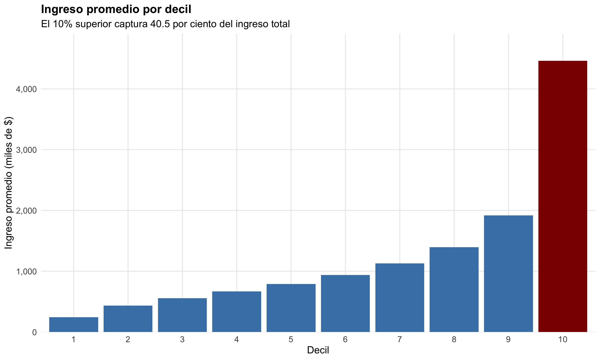

## Abstract

Este estudio analiza los determinantes de la pertenencia al 10% superior de ingresos en Chile utilizando técnicas de machine learning. Mediante el uso combinado de las encuestas CASEN 2020 y EBS 2021, desarrollamos un modelo predictivo que identifica las características socioeconómicas, demográficas y de bienestar subjetivo asociadas a la pertenencia a este grupo. El análisis contribuye a la literatura sobre élites económicas en Chile y América Latina, aportando evidencia sobre los mecanismos de reproducción de la desigualdad económica.

La literatura internacional muestra que el 10% de mayores ingresos presenta características sociodemográficas distintivas que tienen profundas implicaciones para la cohesión social y las políticas públicas: Influencia Política (Gilens, 2012); impacto en Desigualdad y Bienestar (Wilkinson & Pickett, 2010; 2019); Segregación Social (Méndez & Gayo, 2024; Hernando & Mitchell, 2023). En ese contexto, un modelo predictivo de Machine Learning permitirá:
- Validar si los patrones internacionales se replican en Chile
- Identificar variables no teorizadas previamente


## Objetivos

### Objetivo General
Desarrollar y evaluar un modelo de machine learning para predecir la pertenencia al 10% superior de ingresos en Chile utilizando datos socioeconómicos y de bienestar.

### Objetivos Específicos
- Identificar un conjunto de variables capaces de predecir la pertenencia al 10% superior de ingresos
- Examinar la distribución espacial y las características socioeconómicas del 10% superior de ingresos
- Evaluar el desempeño predictivo de diferentes algoritmos de machine learning
- Analizar la importancia relativa de las variables en la predicción

## Preparación y descripción de los datos
Para comenzar el análisis, se cargan las bibliotecas necesarias y se establecen los parámetros de configuración. Se utiliza una combinación de paquetes para manipulación de datos (haven, dplyr, tidyr, purrr, magrittr, stringr), visualización (ggplot2, scales, viridis, DiagrammeR), manejo de datos espaciales (sf, geodata, chilemapas, rmapshaper) y presentación de resultados (kableExtra), presentación (kableExtra, webshot2, naniar) y utilidades (devtools, rlang).

```{r setup, include=FALSE}
knitr::opts_chunk$set(
  echo = FALSE,
  message = FALSE,
  warning = FALSE,
  fig.width = 10,
  fig.height = 6,
  dpi = 300
)

source("setup.R")
check_data()

packages <- c(
  "haven",
  "dplyr",
  "ggplot2",
  "scales",
  "kableExtra",
  "purrr",
  "sf",
  "viridis",
  "geodata",
  "devtools",
  "rmapshaper", 
  "magrittr", 
  "stringr", 
  "rlang",
  "DiagrammeR",
  "webshot2",
  "tidyr",
  "naniar",
  "vip",
  "ranger",
  "caret",
  "mice",
  "tidyverse",
  "pROC",
  "caret",
  "pacman"
)

for(pkg in packages) {
  if(!require(pkg, character.only = TRUE)) {
    install.packages(pkg)
    library(pkg, character.only = TRUE)
  }
}
devtools::install_github("pachamaltese/chilemapas")
library(chilemapas)
data(chile_regiones)
chile_map <- gadm("CHL", level=1, path=tempdir())


```

##2. Carga y preparación inicial de datos
El análisis utiliza dos fuentes principales de datos:

CASEN 2020 (versión reducida, en formato rds para poder subirse a GitHub): Proporciona información socioeconómica detallada
EBS 2021: Complementa con información adicional (especialmente de bienestar) y factores de expansión actualizados

En el proceso de preparación, se realizan los siguientes pasos:
a. Cálculo de deciles de ingreso para identificar el 10% superior según la muestra total de la encuesta CASEN, no de la submuestra de la EBS.
b. Creación de variable binaria para el grupo objetivo.
c. Merge de ambas bases de datos manteniendo la estructura de la CASEN.

```{r}
casen <- readRDS(ruta_casen)
ebs <- read_sav(ruta_ebs)

# Ver qué variables tenemos disponibles
# print(names(casen))
# print(names(ebs))

# Calcular deciles y crear variable top10 en CASEN
casen <- casen %>%
  mutate(
    decil = ntile(ytotcorh, 10),
    top10 = ifelse(decil == 10, 1, 0)
  ) %>%
  rename(
    folio_casen = folio,
    id_persona_casen = id_persona
  )

# Realizar el merge manteniendo todas las variables
merged_data <- merge(
  casen,  
  ebs %>% select(
    folio_casen, id_persona_casen, fexp, region,
    j3a_1, j3a_4, a3_4, j3a_5,  # Variables de bienestar laboral
    c1_4, c1_5, c3_2, c6,        # Variables de uso del tiempo
    l8, l9, l10a, l10b         # Variables para identificar situación laboral
  ),  
  by = c("folio_casen", "id_persona_casen"),
  suffixes = c("_casen", "_ebs")  # Para diferenciar variables duplicadas
) %>%
  mutate(
    elite = ifelse(decil == 10, 1, 0),
    elite_label = factor(ifelse(decil == 10, "10% superior", "Resto"))
  )
```

La tabla de resumen del proceso de merge que aparece en el documento muestra que:

- CASEN original tiene 185,437 observaciones: Presenta sólo 98 NAs en la variable ytotcorh de ingreso, lo cual es marginal. También debe considerarse que estamos tomando al hogar como unidad y no a individuos (y los individuos que responden la encuesta pueden no corresponder a los/las jefes/as de hogar).
- EBS y la base final fusionada tienen 10,921 observaciones (debe considerarse también que quienes responden no necesariamente con la misma persona que en el caso de CASEN, a pesar de ser el mismo hogar).

Esto implica una retención del 5.9% de la muestra original de CASEN, lo cual es esperable dado que la EBS es una submuestra de CASEN. Lo crucial aquí es verificar que esta submuestra mantiene representatividad, especialmente para el grupo de interés (10% superior).

### Representatividad y factores de expansión:
Del análisis de los factores de expansión se observa:

- El 10% superior representa 1,859,535 personas en la población.
- El resto representa 13,304,855 personas.
- La razón de expansión promedio es mayor para el grupo elite (1,909 vs 1,337).

```{r data_merging_analysis}
# Análisis inicial de datos antes del merge
n_casen_original <- nrow(casen)
n_ebs_original <- nrow(ebs)

# Análisis después del merge
n_merged <- nrow(merged_data)

# Crear tabla de resumen del proceso de merge
merge_summary <- data.frame(
  etapa = c("CASEN original", "EBS original", "Después del merge"),
  n_observaciones = c(n_casen_original, n_ebs_original, n_merged)
) %>%
  mutate(
    perdida_registros = c(NA, NA, n_casen_original - n_merged),
    porcentaje_retencion = c(NA, NA, round(n_merged/n_casen_original * 100, 1))
  )

kable(merge_summary,
      caption = "Resumen del proceso de merge CASEN-EBS",
      col.names = c("Etapa", "N observaciones", "Pérdida de registros", "% retención")) %>%
  kable_styling(bootstrap_options = c("striped", "hover"))

# Análisis de deciles antes y después del merge
deciles_comparison <- casen %>%
  group_by(decil) %>%
  summarise(n_casen = n()) %>%
  left_join(
    merged_data %>%
      group_by(decil) %>%
      summarise(n_merged = n()),
    by = "decil"
  ) %>%
  mutate(
    prop_retencion = round(n_merged/n_casen * 100, 1)
  )

kable(deciles_comparison,
      caption = "Retención de observaciones por decil después del merge",
      col.names = c("Decil", "N en CASEN", "N después del merge", "% retención")) %>%
  kable_styling(bootstrap_options = c("striped", "hover"))
```

Los 974 casos que pertenecen al 10% superior representan aproximadamente el 9% de nuestra muestra, lo cual es consistente con la distribución poblacional esperada. Esto nos proporciona una base sólida para el modelamiento:

- La proporción 9%-91% (vs un 10%-90% ideal) representa un desbalance moderado.
- Es manejable con ponderación de clases en Random Forest.
- No requiere submuestreo de la clase mayoritaria.

Rothman y Greenland (2018) argumentan que es más apropiado planificar el tamaño del estudio basándose en la precisión deseada rather que en el poder estadístico tradicional. En nuestro caso, con 974 casos  de 10,921 observaciones, alcanzamos una precisión adecuada.

En términos del tamaño muestral requerido para el análisis predictivo, considerando aproximadamente 45 predictores candidatos (6-1[dummy] en bienestar, 9-1 en tenencia, 5-1 en nivel educacional, 12-1 intervalos de edad, 16-1 en Región, más zona y sexo), los 974 eventos nos proporcionan 21.6 eventos por variable, superando los umbrales mínimos estándar en la literatura de predicción. Si bien este criterio es simplificador (van Smeden et al., 2019), proporciona una base razonable para proceder con el análisis predictivo propuesto.

##  Modelo Entidad-Relación
El diagrama presentado muestra la estructura de los datos, que se organiza en cuatro entidades principales:

- REGIÓN {id_region}: Permite el análisis territorial de la distribución del ingreso.
- HOGAR {folio_casen} Unidad fundamental de análisis económico.
- INDIVIDUO {id_persona_casen} Unidad básica de observación.
- CARACTERÍSTICAS: Atributos del individuo (sea o no jefe/a de hogar).

```{r}
DiagrammeR::grViz("
  digraph ER {
    # Configuración general del gráfico
    graph [rankdir = TB, 
           fontname = 'Helvetica',
           nodesep = 0.4,
           ranksep = 0.6]
           
    # Configuración de nodos
    node [shape = rectangle, 
          style = filled, 
          fillcolor = lightblue, 
          fontname = 'Helvetica',
          fontsize = 10,
          width = 2,
          height = 0.5]
          
    # Configuración de bordes
    edge [fontname = 'Helvetica',
          fontsize = 8,
          len = 1.2]

    # Entidades principales
    region [label = 'REGIÓN\n{id_region}\n(nombre)', width = 2]
    hogar [label = 'HOGAR\n{folio_casen}\n(ingresos_totales, n_integrantes,\ntipo_vivienda, tenencia)', width = 3]
    individuo [label = 'INDIVIDUO\n{id_persona_casen}\n(edad, sexo, elite)', width = 2.5]

    # Atributos como subentidades
    educacion [label = 'CARACTERÍSTICAS EDUCATIVAS\n(nivel, años)', width = 2.5]
    trabajo [label = 'CARACTERÍSTICAS LABORALES\n(ocupación, categoría, cotización)', width = 2.5]
    bienestar [label = 'BIENESTAR\n(uso tiempo, satisfacción,\nredes sociales)', width = 2.5]

    # Relaciones
    region -> hogar [label = 'contiene']
    hogar -> individuo [label = 'compuesto por']
    
    # Relaciones con atributos
    individuo -> educacion [label = 'tiene']
    individuo -> trabajo [label = 'tiene']
    individuo -> bienestar [label = 'tiene']

    # Alineación y espaciado
    {rank = same; educacion; trabajo; bienestar}
    
    # Nota explicativa
    nota [label = 'Variable objetivo:\nelite (1: pertenece al 10% superior, 0: resto)', 
          shape = note, 
          fillcolor = lightyellow,
          width = 3]
    nota -> hogar [style = dashed]
  }
", 
width = 800, height = 500)
```

## Análisis descriptivo inicial
Examinación de valores faltantes
El gráfico de patrones de valores faltantes nos muestra una estructura importante:

- Variables sin datos faltantes (0% missing):
Variables sociodemográficas básicas (edad, sexo, zona, región)
Variables económicas (ytotcorh, elite, fexp)
Variables educativas (e6a)
Variables de vivienda (v13)

- Variables con alta tasa de missing (~42%):
Variables de bienestar laboral (j3a_1, j3a_4, j3a_5): 4,606 casos missing
Variables de uso del tiempo (a3_4, c3_2, c6): 4,606 casos missing

- Variables con tasa media de missing (~35%):
Tenencia de vivienda (v13_propia): 3,805 casos missing

Esto sugiere:
Las variables socioeconómicas básicas están completas.
Hay un patrón sistemático de no respuesta en variables de bienestar.
La pérdida de información en variables de bienestar afecta aproximadamente al 42% de la muestra.

```{r missing_pattern_complete, fig.height=12, fig.width=10}
stats_deciles <- merged_data %>%
  group_by(decil) %>%
  summarise(
    n = n(),
    n_expandido = sum(fexp),
    ingreso_medio = weighted.mean(ytotcorh, fexp, na.rm = TRUE),
    proporcion_poblacion = sum(fexp)/sum(merged_data$fexp)
  )

vars_of_interest <- c(
  # Variables sociodemográficas básicas (verificadas en el merge)
  "edad", "sexo", "zona", "region", 
  
  # Variables educativas y de vivienda
  "e6a", "v13", "v13_propia",
  
  # Variables económicas
  "ytotcorh", "elite", "fexp",
  
  # Variables de bienestar de EBS (verificar nombres exactos)
  "j3a_1", "j3a_4", "a3_4", "j3a_5",
  "c1_4", "c1_5", "c3_2", "c6"
)

# Verificar primero qué variables existen
existing_vars <- names(merged_data)
vars_of_interest <- vars_of_interest[vars_of_interest %in% existing_vars]

# Crear visualización de patrones de valores faltantes
gg_miss_var(merged_data[vars_of_interest]) +
  theme_minimal() +
  theme(
    axis.text.y = element_text(size = 9),
    plot.title = element_text(size = 12, face = "bold"),
    panel.grid.major.x = element_line(color = "grey90"),
    panel.grid.minor.x = element_blank()
  ) +
  labs(
    title = "Patrón de valores faltantes en variables principales",
    subtitle = "Se muestran todas las variables relevantes para el modelo",
    x = "Número de valores faltantes",
    y = "Variables"
  )

# Crear tabla resumen de valores faltantes
missing_summary <- merged_data[vars_of_interest] %>%
  summarise(across(everything(), 
                  list(
                    n_missing = ~sum(is.na(.)),
                    pct_missing = ~mean(is.na(.)) * 100
                  ))) %>%
  pivot_longer(everything(), 
               names_to = c("variable", "stat"), 
               names_pattern = "(.*)_(n_missing|pct_missing)") %>%
  pivot_wider(names_from = stat, 
             values_from = value) %>%
  mutate(
    total_obs = nrow(merged_data),
    obs_available = total_obs - n_missing,
    pct_missing = round(pct_missing, 2)
  ) %>%
  arrange(desc(pct_missing))

# Mostrar tabla de resumen
kable(missing_summary,
      col.names = c("Variable", "N Missing", "% Missing", "Total Obs", "Obs Disponibles"),
      caption = "Resumen detallado de valores faltantes por variable") %>%
  kable_styling(bootstrap_options = c("striped", "hover", "condensed")) %>%
  row_spec(which(missing_summary$pct_missing > 20), 
          background = "#FFE5E5")  # Resaltar variables con más del 20% de valores faltantes


```

## Visualización de la distribución por deciles

El gráfico de ingresos promedio por decil muestra una marcada desigualdad. El décimo decil (en rojo) tiene un ingreso promedio de más de 4 millones de pesos. La diferencia con el noveno decil es especialmente notoria, pues el 10% superior captura 40.5% del ingreso total.

```{r}
# Calcular proporción del ingreso del 10% superior
total_income_weighted <- sum(merged_data$ytotcorh * merged_data$fexp, na.rm = TRUE)
top10_income_weighted <- sum(merged_data$ytotcorh[merged_data$top10 == 1] * 
                           merged_data$fexp[merged_data$top10 == 1], na.rm = TRUE)

# Formatear datos para el gráfico
stats_deciles$ingreso_medio_miles <- stats_deciles$ingreso_medio/1000

# Crear el gráfico
p <- ggplot(stats_deciles, aes(x = factor(decil), y = ingreso_medio_miles)) +
  geom_bar(stat = "identity", fill = "steelblue") +
  geom_bar(data = subset(stats_deciles, decil == 10), 
           aes(x = factor(decil), y = ingreso_medio_miles),
           fill = "darkred", 
           stat = "identity") +
  scale_y_continuous(
    labels = function(x) format(x, big.mark = ",", scientific = FALSE),
    expand = expansion(mult = c(0, 0.1))
  ) +
  labs(
    title = "Ingreso promedio por decil",
    subtitle = paste("El 10% superior captura", 
                    format(round(top10_income_weighted/total_income_weighted*100, 1), 
                           nsmall = 1),
                    "por ciento del ingreso total"),
    x = "Decil",
    y = "Ingreso promedio (miles de $)"
  ) +
  theme_minimal() +
  theme(
    plot.title = element_text(face = "bold", size = 14),
    plot.subtitle = element_text(size = 12),
    axis.title = element_text(size = 12),
    axis.text = element_text(size = 10),
    panel.grid.minor = element_blank()
  )

# Guardar y mostrar el gráfico
if (!dir.exists("outputs")) dir.create("outputs")
jpeg(filename = "outputs/grafico_deciles.jpg",
     width = 10, height = 6, 
     units = "in", res = 300)
print(p)
dev.off()


```

## Caracterización del 10% superior vs resto de la población
La tabla siguiente compara características clave entre este grupo y el resto de la población. Se incluyen variables territoriales (región, urbano/rural), demográficas (edad, sexo), socioeconómicas (educación) y de bienestar. Los valores están ponderados usando los factores de expansión provistos por la EBS: seleccionamos éstos en vez de los de CASEN por tratarse de una encuesta bifásica.

```{r}
# Variable dummy para el 10% superior
merged_data <- merged_data %>%
  mutate(
    elite = ifelse(decil == 10, 1, 0),
    elite_label = factor(ifelse(decil == 10, "10% superior", "Resto"))
  )

# Análisis descriptivo por grupo
stats_descriptivos <- merged_data %>%
  group_by(elite_label) %>%
  summarise(
    n = n(),
    n_expandido = sum(fexp),
    ingreso_promedio = round(weighted.mean(ytotcorh, fexp, na.rm = TRUE)),
    desv_est = round(sqrt(weighted.mean((ytotcorh - weighted.mean(ytotcorh, fexp))^2, fexp))),
    edad_promedio = weighted.mean(edad, fexp, na.rm = TRUE),
    prop_hombres = weighted.mean(sexo == 1, fexp, na.rm = TRUE),
    prop_urbano = weighted.mean(zona == 1, fexp, na.rm = TRUE)
  ) %>%
  mutate(
    prop_muestra = n/sum(n),
    prop_poblacion = n_expandido/sum(n_expandido)
  )

# Mostrar tabla de estadísticas descriptivas
stats_descriptivos %>%
  kbl(caption = "Características del 10% superior vs resto", 
      digits = 2,
      format.args = list(big.mark = ",")) %>%
  kable_styling(bootstrap_options = c("striped", "hover"))
```

## Análisis territorial

El análisis territorial se desarrolla en dos dimensiones complementarias:

Proporción interna: Qué porcentaje de la población de cada región pertenece al 10% superior
Distribución nacional: Cómo se distribuye el total del 10% superior entre las regiones

Para facilitar la interpretación, se ordenan las regiones de norte a sur.

```{r}
# Nombres de regiones ordenadas de norte a sur
nombres_regiones <- c(
  "15" = "Arica y Parinacota",
  "1" = "Tarapacá",
  "2" = "Antofagasta",
  "3" = "Atacama",
  "4" = "Coquimbo",
  "5" = "Valparaíso",
  "13" = "Metropolitana",
  "6" = "O'Higgins",
  "7" = "Maule",
  "8" = "Biobío",
  "16" = "Ñuble",
  "9" = "Araucanía",
  "14" = "Los Ríos",
  "10" = "Los Lagos",
  "11" = "Aysén",
  "12" = "Magallanes"
)

# Recodificar la variable región manteniendo el orden norte-sur
merged_data <- merged_data %>%
  mutate(
    region_nombre = factor(region,
                          levels = rev(c("15", "1", "2", "3", "4", "5", "13", "6", 
                                   "7", "8", "16", "9", "14", "10", "11", "12")),
                          labels = rev(nombres_regiones[c("15", "1", "2", "3", "4", "5", "13", "6", 
                                                    "7", "8", "16", "9", "14", "10", "11", "12")]),
                          ordered = TRUE)
  )

# Calcular stats_region para el primer gráfico
stats_region <- merged_data %>%
  group_by(region_nombre) %>%
  summarise(
    n = n(),
    prop_elite = weighted.mean(elite, fexp, na.rm = TRUE),
    ingreso_medio = weighted.mean(ytotcorh, fexp, na.rm = TRUE)
  )

# Calcular la distribución del 10% superior entre regiones
stats_distribucion <- merged_data %>%
  group_by(region_nombre) %>%
  summarise(
    n_elite = sum(elite * fexp),  # Número ponderado de elite en cada región
    n_total = sum(fexp)          # Población total ponderada
  ) %>%
  ungroup() %>%
  mutate(
    prop_distribucion = n_elite / sum(n_elite)  # Proporción del total de elite
  )

# Gráfico de barras original (porcentaje de elite dentro de cada región)
p1 <- ggplot(stats_region, 
       aes(x = region_nombre, 
           y = prop_elite)) +
  geom_bar(stat = "identity", fill = "steelblue") +
  coord_flip() +
  scale_y_continuous(labels = scales::percent) +
  labs(
    title = "Proporción del 10% superior por región",
    subtitle = "% de habitantes de cada región que pertenece al 10% superior",
    x = "Región",
    y = "Proporción del 10% superior"
  ) +
  theme_minimal() +
  theme(
    axis.text.y = element_text(size = 8),
    plot.title = element_text(face = "bold"),
    panel.grid.minor = element_blank()
  )

# Nuevo gráfico de barras (distribución del 10% superior entre regiones)
p2 <- ggplot(stats_distribucion, 
       aes(x = region_nombre, 
           y = prop_distribucion)) +
  geom_bar(stat = "identity", fill = "darkred") +
  coord_flip() +
  scale_y_continuous(labels = scales::percent) +
  labs(
    title = "Distribución regional del 10% superior",
    subtitle = "Cómo se distribuye el 10% superior entre las regiones",
    x = "Región",
    y = "% del total del 10% superior"
  ) +
  theme_minimal() +
  theme(
    axis.text.y = element_text(size = 8),
    plot.title = element_text(face = "bold"),
    panel.grid.minor = element_blank()
  )

# Mostrar los gráficos
p1
p2
```

Los gráficos resultantes revelan patrones interesantes. La proporción de elite dentro de cada región (gráfico azul) muestra una concentración en ciertas regiones (Magallanes, RM, Antofagasta,) La distribución del total de la elite (gráfico rojo) evidencia una fuerte centralización en RM.

## Visualización espacial 

Aquí generamos mapas que permiten una visualización más intuitiva de los patrones espaciales. Se utilizan dos mapas que corresponden a las mismas dimensiones analizadas en los gráficos de barras:

El primer mapa muestra la proporción de habitantes de cada región que pertenece al 10% superior. Este mapa ayuda a identificar dónde es más probable encontrar miembros de la elite económica.
El segundo mapa (en tonos magma) visualiza cómo se distribuye el total de ese 10% entre las regiones.

Para la construcción de estos mapas, se enfrentaron varios desafíos técnicos:
La necesidad de compatibilizar diferentes codificaciones de regiones: Magallanes tenía problemas de visualización que lo convertía persistentemente en NA.

```{r}
# Preparar datos para el primer mapa (proporción dentro de cada región)
datos_mapa1 <- merged_data %>%
  group_by(region) %>%
  summarise(prop_elite = weighted.mean(elite, fexp, na.rm = TRUE)) %>%
  mutate(region = as.character(region))

# Preparar datos para el segundo mapa (distribución entre regiones)
datos_mapa2 <- merged_data %>%
  group_by(region) %>%
  summarise(
    n_elite = sum(elite * fexp),
    n_total = sum(fexp)
  ) %>%
  ungroup() %>%
  mutate(
    region = as.character(region),
    prop_distribucion = n_elite / sum(n_elite)
  )

# Obtener mapa de Chile y asignar valores
chile_map <- geodata::gadm("CHL", level = 1, path = tempdir())
mapa_base <- st_as_sf(chile_map)

# Usar CC_1 para el merge
codigo_region <- c(
  "XV" = "15", "I" = "1", "II" = "2", "III" = "3", "IV" = "4",
  "V" = "5", "RM" = "13", "VI" = "6", "VII" = "7", "VIII" = "8",
  "XVI" = "16", "IX" = "9", "XIV" = "14", "X" = "10", "XI" = "11",
  "XII" = "12"
)

# Preparar base para ambos mapas
mapa_base$region <- codigo_region[mapa_base$CC_1]
mapa1 <- left_join(mapa_base, datos_mapa1, by = "region")
mapa2 <- left_join(mapa_base, datos_mapa2, by = "region")

# Crear el primer mapa (proporción dentro de cada región)
m1 <- ggplot() +
  geom_sf(data = mapa1, 
          aes(fill = prop_elite),
          na.rm = TRUE) +
  scale_fill_viridis_c(
    labels = scales::percent,
    name = "Proporción del\n10% superior",
    option = "plasma",
    direction = -1,
    na.value = "grey50",
    limits = c(0, 0.20),
    oob = scales::squish
  ) +
  labs(
    title = "Proporción del 10% superior por región",
    subtitle = "% de habitantes de cada región que pertenece al 10% superior",
    caption = "Fuente: CASEN 2020"
  ) +
  theme_minimal() +
  theme(
    plot.title = element_text(face = "bold"),
    axis.text = element_blank(),
    axis.ticks = element_blank()
  )

# Crear el segundo mapa (distribución entre regiones)
m2 <- ggplot() +
  geom_sf(data = mapa2, 
          aes(fill = prop_distribucion),
          na.rm = TRUE) +
  scale_fill_viridis_c(
    labels = scales::percent,
    name = "% del total del\n10% superior",
    option = "magma",  # Cambié a magma para distinguirlo del otro mapa
    direction = -1,
    na.value = "grey50",
    oob = scales::squish
  ) +
  labs(
    title = "Distribución regional del 10% superior",
    subtitle = "Cómo se distribuye el 10% superior entre las regiones",
    caption = "Fuente: CASEN 2020"
  ) +
  theme_minimal() +
  theme(
    plot.title = element_text(face = "bold"),
    axis.text = element_blank(),
    axis.ticks = element_blank()
  )

# Mostrar los mapas
m1
m2
```

## Sexo jefe/a de hogar

Recodificación para identificar sexo de jefe de hogar. No es posible saberlo para el 100% de los casos, pero con variables de sexo y de relación de quien responde con jefe/a de hogar, se puede reducir para cerca del 70%.

```{r}
# Deducir sexo del jefe de hogar
merged_data <- merged_data %>%
  group_by(folio_casen) %>%
  mutate(
    sexo_jh = case_when(
      pco1 == 1 ~ sexo,  # Si es jefe/a, su propio sexo
      pco1 == 2 ~ ifelse(sexo == 1, 2, 1),  # Si es cónyuge de distinto sexo, el opuesto
      pco1 == 3 ~ ifelse(sexo == 1, 1, 2),  # Si es cónyuge del mismo sexo, el mismo
      TRUE ~ NA_real_  # Para el resto, no podemos inferir
    )
  ) %>%
  ungroup()

# Verificación de la deducción
print("\nDistribución del sexo del jefe de hogar (incluyendo inferidos):")
table(merged_data$sexo_jh, useNA = "ifany")

# Filtrar solo jefes de hogar para análisis posteriores
merged_data_jh <- merged_data %>%
  filter(pco1 == 1)
```
Observaciones importantes:
- Los hogares con jefatura masculina tienen más del doble de probabilidad de pertenecer al 10% superior.
- Hay una discrepancia entre proporción muestral y poblacional que sugiere sobremuestreo de - hogares con jefatura femenina.
- La proporción de elite es notablemente menor en hogares con jefatura femenina.

```{r}
# Variable de parentesco y filtrar por jefes de hogar
# Definir etiquetas de parentesco
etiquetas_parentesco <- c(
  "1" = "Jefe(a) de Hogar",
  "2" = "Esposo(a) o pareja de distinto sexo",
  "3" = "Esposo(a) o pareja de igual sexo", 
  "4" = "Hijo(a) de ambos",
  "5" = "Hijo(a) sólo del jefe(a)",
  "6" = "Hijo(a) sólo del esposo(a)/pareja",
  "7" = "Padre o madre",
  "8" = "Suegro(a)",
  "9" = "Yerno o nuera",
  "10" = "Nieto(a)",
  "11" = "Hermano(a)",
  "12" = "Cuñado(a)",
  "13" = "Otro Familiar",
  "14" = "No familiar"
)

# Crear y mostrar tabla de parentesco
tab_parentesco <- table(merged_data$pco1, useNA = "ifany")
names(tab_parentesco) <- etiquetas_parentesco[names(tab_parentesco)]
kbl(tab_parentesco, 
    caption = "Distribución de parentesco",
    col.names = c("Parentesco", "Frecuencia")) %>%
  kable_styling(bootstrap_options = c("striped", "hover"))

# Filtrar solo jefes de hogar
merged_data_jh <- merged_data %>%
  filter(pco1 == 1)  # Asumiendo que 1 es el código para jefe de hogar

# Recodificación de sexo para jefes de hogar
merged_data_jh <- merged_data_jh %>%
  mutate(
    sexo_rec = case_when(
      sexo == 2 ~ 0,  # Mujer
      sexo == 1 ~ 1,  # Hombre
      TRUE ~ NA_real_
    ))

# Tabla de distribución por sexo
tabla_sexo <- merged_data_jh %>%
  group_by(sexo_rec) %>%
  summarise(
    n = n(),
    n_expandido = sum(fexp),
    prop_elite = weighted.mean(elite, fexp, na.rm = TRUE)
  ) %>%
  mutate(
    prop_muestra = n/sum(n),
    prop_poblacion = n_expandido/sum(n_expandido),
    prop_elite = scales::percent(prop_elite, accuracy = 0.1),
    sexo_rec = factor(sexo_rec, levels = c(0,1), 
                     labels = c("Mujer", "Hombre"))
  )

# Mostrar tabla de sexo
tabla_sexo %>%
  kbl(caption = "Distribución y proporción de elite por sexo del jefe de hogar",
      col.names = c("Sexo", "N", "N expandido", "Proporción elite", 
                   "Proporción muestra", "Proporción población"),
      digits = c(0,0,0,1,3,3)) %>%
  kable_styling(bootstrap_options = c("striped", "hover"))
```

## Edad

Se utilizan intervalos quinquenales desde los 30 años e intervalos más amplios en edades extremas. Concentración en edades medias: El peak de proporción elite está en 30-34 años (19.5%)
y 35-39 años (17.3%). Declina consistentemente después de los 40.

Tiene muy baja representación en extremos: jóvenes (2.2% en 18-29) y casi nula en mayores de 80 (0.3%). Declina fuertemente después de los 70 años.

Diferencias muestra-población:
- Ligera subrepresentación de grupos 30-39 años.
- Sobrerrepresentación de grupos mayores.
- Factor de expansión utilizados.

```{r}
# Tabla de edad
merged_data_jh <- merged_data_jh %>%
  mutate(
    edad_rec = case_when(
      edad < 18 ~ "Menor de 18",
      edad >= 18 & edad < 30 ~ "18-29",
      edad >= 30 & edad < 35 ~ "30-34",
      edad >= 35 & edad < 40 ~ "35-39",
      edad >= 40 & edad < 45 ~ "40-44",
      edad >= 45 & edad < 50 ~ "45-49",
      edad >= 50 & edad < 55 ~ "50-54",
      edad >= 55 & edad < 60 ~ "55-59",
      edad >= 60 & edad < 65 ~ "60-64",
      edad >= 65 & edad < 70 ~ "65-69",
      edad >= 70 & edad < 75 ~ "70-74",
      edad >= 75 & edad < 80 ~ "75-79",
      edad >= 80 ~ "80 o más",
      TRUE ~ NA_character_
    ),
    edad_rec = factor(edad_rec, levels = c("Menor de 18", "18-29", "30-34", 
                                         "35-39", "40-44", "45-49", "50-54",
                                         "55-59", "60-64", "65-69", "70-74",
                                         "75-79", "80 o más"))
  )

tabla_edad <- merged_data_jh %>%
  group_by(edad_rec) %>%
  summarise(
    n = n(),
    n_expandido = sum(fexp),
    prop_elite = weighted.mean(elite, fexp, na.rm = TRUE)
  ) %>%
  mutate(
    prop_muestra = n/sum(n),
    prop_poblacion = n_expandido/sum(n_expandido),
    prop_elite = scales::percent(prop_elite, accuracy = 0.1)
  )

tabla_edad %>%
  kbl(caption = "Distribución y proporción de elite por grupo de edad",
      col.names = c("Grupo de edad", "N", "N expandido", "Proporción elite (ponderada)", 
                   "Proporción muestra", "Proporción población"),
      digits = c(0,0,0,1,3,3)) %>%
  kable_styling(bootstrap_options = c("striped", "hover"))
```

## Nivel educacional

Decisiones clave aquí:
- Agrupación en 5 categorías principales
- Distinción entre educación técnica y universitaria
- Postgrado como categoría separada, a pesar del bajo N, por la sobrerepresentación del 10% superior.
- Manejo explícito de valores NA

```{r}
# Tabla de nivel educacional
merged_data <- merged_data %>%
  mutate(
    educ_rec = case_when(
      e6a %in% c(1, 5, 6, 7) ~ "Hasta básica",
      e6a %in% c(8, 9, 10, 11) ~ "Hasta media",
      e6a %in% c(12, 13) ~ "Técnica superior",
      e6a %in% c(14, 15) ~ "Universitaria",
      e6a %in% c(16, 17) ~ "Postgrado",
      is.na(e6a) ~ NA_character_,
      TRUE ~ "Otra"
    ))

tabla_educ <- merged_data %>%
  group_by(educ_rec) %>%
  summarise(
    n = n(),
    n_expandido = sum(fexp),
    prop_elite = weighted.mean(elite, fexp, na.rm = TRUE)
  ) %>%
  mutate(
    prop_muestra = n/sum(n),
    prop_poblacion = n_expandido/sum(n_expandido),
    prop_elite = scales::percent(prop_elite, accuracy = 0.1)
  )

tabla_educ %>%
  kbl(caption = "Distribución y proporción de elite por nivel educacional",
      col.names = c("Nivel educacional", "N", "N expandido", "Proporción elite (ponderada)", 
                   "Proporción muestra", "Proporción población"),
      digits = c(0,0,0,1,3,3)) %>%
  kable_styling(bootstrap_options = c("striped", "hover"))
```

Gradiente educacional marcado:
- Postgrado: 58.7% pertenece al 10% superior; Universitaria: 30.5%; Técnica superior: 9.9%; Media o menos: < 5%.

Marcada diferencia con distribución poblacional:41.1% tiene hasta educación media; 25.3% tiene educación universitaria; Solo 2.2% tiene postgrado.

## Resumen variables potencialmente predictoras

Para preparar la fase de modelamiento, se realiza un análisis exploratorio de las variables que podrían predecir la pertenencia al 10% superior. El análisis de estas variables se realiza considerando:
- Su distribución diferenciada entre elite y no elite
- La presencia de valores faltantes que podrían afectar el modelamiento
- La necesidad de transformaciones o recodificaciones para su uso en modelos predictivos

Decisiones relevantes:
- Combinación de tipo (v13) y propiedad (v13_propia)
- Distinción entre vivienda pagada y en proceso de pago
- Categorización explícita de situaciones irregulares

```{r}
# Creación de variable combinada de tenencia de vivienda
merged_data <- merged_data %>%
  mutate(
    tenencia_vivienda = case_when(
      v13 == 1 & v13_propia == 1 ~ "Propia pagada",
      v13 == 1 & v13_propia == 2 ~ "Propia pagándose",
      v13 == 1 & v13_propia == 3 ~ "Propia compartida (pagada)",
      v13 == 1 & v13_propia == 4 ~ "Propia compartida (pagándose)",
      v13 == 2 ~ "Arrendada",
      v13 == 3 ~ "Cedida",
      v13 == 9 ~ "Usufructo",
      v13 == 10 ~ "Ocupación irregular",
      v13 == 11 ~ "Poseedor irregular",
      TRUE ~ "Sin información"
    ) %>%
      factor(levels = c(
        "Propia pagada",
        "Propia pagándose",
        "Propia compartida (pagada)",
        "Propia compartida (pagándose)",
        "Arrendada",
        "Cedida",
        "Usufructo",
        "Ocupación irregular",
        "Poseedor irregular",
        "Sin información"
      ))
  )

# Tabla de distribución
tabla_tenencia <- merged_data %>%
  group_by(tenencia_vivienda) %>%
  summarise(
    n = n(),
    n_expandido = sum(fexp),
    prop_elite = weighted.mean(elite, fexp, na.rm = TRUE)
  ) %>%
  mutate(
    prop_muestra = n/sum(n),
    prop_poblacion = n_expandido/sum(n_expandido),
    prop_elite = scales::percent(prop_elite, accuracy = 0.1)
  )

# Mostrar tabla de tenencia
tabla_tenencia %>%
  kbl(caption = "Distribución y proporción de elite por tenencia de vivienda",
      col.names = c("Tenencia", "N", "N expandido", "Proporción elite (ponderada)", 
                   "Proporción muestra", "Proporción población"),
      digits = c(0,0,0,1,3,3)) %>%
  kable_styling(bootstrap_options = c("striped", "hover"))
```

Patrones destacados: Alta proporción elite en vivienda propia pagándose (36.1%), mucho más que en vivienda propia pagada (9.7%). Respecto a la muestra total, hay un predominio de vivienda propia pagada (55.1%) e importante sector de arriendo (19.2%).


Casos especiales:
Alto porcentaje elite en propiedad compartida pagándose (88.4%), pero muy pocos casos (n=3).

## Variables potenciales

```{r}
stats_edad <- merged_data %>%
  group_by(elite_label) %>%
  summarise(
    N = n(),
    Media = weighted.mean(edad, fexp, na.rm = TRUE),
    DE = sd(edad, na.rm = TRUE),
    `NA's (%)` = scales::percent(mean(is.na(edad)))
  )

# Mostrar tabla de edad
stats_edad %>%
  kbl(caption = "Estadísticas de edad por grupo",
      digits = 2) %>%
  kable_styling(bootstrap_options = c("striped", "hover"))

# Variables categóricas
# Función helper para crear tablas de variables categóricas
crear_tabla_categoria <- function(data, var, var_label) {
  data %>%
    group_by(!!sym(var)) %>%
    summarise(
      `N sin ponderar` = n(),
      `N ponderado` = sum(fexp),
      `N elite` = sum(elite),
      `% del total` = scales::percent(n()/nrow(data), 0.1),
      `% Elite (ponderado)` = scales::percent(weighted.mean(elite, fexp, na.rm = TRUE), 0.1),
      `NA's (%)` = scales::percent(mean(is.na(!!sym(var))))
    ) %>%
    arrange(desc(`N sin ponderar`))
}

# Sexo
tabla_sexo <- crear_tabla_categoria(
  merged_data %>% 
    mutate(sexo = factor(sexo, levels = c(1, 2),
                        labels = c("Hombre", "Mujer"))),
  "sexo", "Sexo"
)

# Mostrar tabla de sexo
tabla_sexo %>%
  kbl(caption = "Distribución por sexo") %>%
  kable_styling(bootstrap_options = c("striped", "hover"))

# Zona
tabla_zona <- crear_tabla_categoria(
  merged_data %>% 
    mutate(zona = factor(zona, levels = c(1, 2),
                        labels = c("Urbana", "Rural"))),
  "zona", "Zona"
)

# Mostrar tabla de zona
tabla_zona %>%
  kbl(caption = "Distribución por zona") %>%
  kable_styling(bootstrap_options = c("striped", "hover"))

# Región
tabla_region <- crear_tabla_categoria(merged_data, 
                                    "region_nombre", 
                                    "Región")

# Mostrar tabla de región
tabla_region %>%
  kbl(caption = "Distribución por región") %>%
  kable_styling(bootstrap_options = c("striped", "hover"))

# Nivel educacional
tabla_educ <- crear_tabla_categoria(merged_data, 
                                  "educ_rec", 
                                  "Nivel educacional")

# Mostrar tabla de nivel educacional
tabla_educ %>%
  kbl(caption = "Distribución por nivel educacional") %>%
  kable_styling(bootstrap_options = c("striped", "hover"))

# Tenencia de vivienda
tabla_tenencia <- crear_tabla_categoria(merged_data, 
                                      "tenencia_vivienda", 
                                      "Tenencia de vivienda")

# Mostrar tabla de tenencia
tabla_tenencia %>%
  kbl(caption = "Distribución por tenencia de vivienda") %>%
  kable_styling(bootstrap_options = c("striped", "hover"))

```

La tabla resultante proporciona una primera aproximación a la capacidad predictiva de cada variable, mostrando diferencias significativas en varias dimensiones entre el grupo elite y el resto de la población. Por ejemplo, el 10% es más joven en promedio (41,27 vs 44,87) y tiene mayor proporción de hombres  (14% vs 10,6%) y hay fuerte concentración en urbes (13,2% vs 5,3%).

Sin embargo, hay importantes diferencias en la calidad de los datos. Las variables básicas tienen pocos valores faltantes (0% NA's) y hay buena representatividad en categorías principales.

## Variables de bienestar de EBS

Decisiones importantes aquí:
- Uso de scale() para normalizar variables
- Restricción a valores 1-5 en la escala original
- Codificación explícita de NA para otros valores

```{r}
# Variables de bienestar EBS
merged_data <- merged_data %>%
  mutate(
    # Variables de bienestar (estandarizadas)
    apoyo_empleabilidad = scale(case_when(
      j3a_1 %in% 1:5 ~ j3a_1,
      TRUE ~ NA_real_
    ))[,1],
    
    balance_trabajo_vida = scale(case_when(
      j3a_4 %in% 1:5 ~ j3a_4,
      TRUE ~ NA_real_
    ))[,1],
    
    satisfaccion_tiempo = scale(case_when(
      a3_4 %in% 1:5 ~ a3_4,
      TRUE ~ NA_real_
    ))[,1],
    
    logro_metas = scale(case_when(
      j3a_5 %in% 1:5 ~ j3a_5,
      TRUE ~ NA_real_
    ))[,1],
    
    interferencia_domestica = scale(case_when(
      c6 %in% 1:5 ~ c6,
      TRUE ~ NA_real_
    ))[,1],
    
    flexibilidad_ausencias = case_when(
      c3_2 == 1 ~ 1,  # Sí
      c3_2 == 2 ~ 0,  # No
      TRUE ~ NA_real_
    )
  )

# Tabla de variables de bienestar
variables_bienestar <- c("apoyo_empleabilidad", "balance_trabajo_vida", 
                        "satisfaccion_tiempo", "logro_metas", 
                        "interferencia_domestica", "flexibilidad_ausencias")

tabla_bienestar <- data.frame(
  Variable = c("Apoyo a empleabilidad", "Balance trabajo-vida",
               "Satisfacción con tiempo", "Logro de metas",
               "Interferencia doméstica", "Flexibilidad ausencias")
)

# Calculamos estadísticas para No elite (elite = 0)
stats_no_elite <- merged_data %>%
  filter(elite == 0) %>%
  summarise(across(all_of(variables_bienestar),
                  list(media = ~mean(., na.rm = TRUE),
                       de = ~sd(., na.rm = TRUE)))) %>%
  t() %>%
  as.data.frame()

# Calculamos estadísticas para Elite (elite = 1)
stats_elite <- merged_data %>%
  filter(elite == 1) %>%
  summarise(across(all_of(variables_bienestar),
                  list(media = ~mean(., na.rm = TRUE),
                       de = ~sd(., na.rm = TRUE)))) %>%
  t() %>%
  as.data.frame()

# Combinamos todo
tabla_bienestar$`Media no elite` <- stats_no_elite[seq(1, nrow(stats_no_elite), 2), 1]
tabla_bienestar$`DE no elite` <- stats_no_elite[seq(2, nrow(stats_no_elite), 2), 1]
tabla_bienestar$`Media elite` <- stats_elite[seq(1, nrow(stats_elite), 2), 1]
tabla_bienestar$`DE elite` <- stats_elite[seq(2, nrow(stats_elite), 2), 1]

# Mostrar tabla
tabla_bienestar %>%
  kbl(caption = "Comparación de variables de bienestar entre grupos (valores estandarizados)",
      digits = 2) %>%
  kable_styling(bootstrap_options = c("striped", "hover"))
```

Patrones clave identificados
- Diferencias positivas para el 10% superior: Mayor logro de metas, mayor apoyo empleabilidad; mejor balance trabajo-vida.
- Diferencias negativas/neutras: Menor interferencia doméstica; Diferencias mínimas en satisfacción con tiempo y flexibilidad de ausencias.

Implicancias para el análisis:
- Las variables de bienestar muestran diferencias sistemáticas.
- Potencial predictivo moderado pero consistente.
- Sin embargo, alto número de NAs.
- Se podría considerar un índice compuesto de bienestar.

## Propuesta de modelo de Machine Learning

A partir de lo anterior, se sugiere un Random Forest  para predecir la pertenencia al 10% superior de ingresos. Esta elección se fundamenta en varias características específicas de nuestros datos y objetivos analíticos. En primer lugar, hemos identificado relaciones no lineales importantes, particularmente en variables como edad y educación. Random Forest, al construir múltiples árboles de decisión, puede capturar estas no linealidades sin necesidad de especificación explícita.

Además, nuestros datos presentan una estructura jerárquica territorial, con importantes efectos de interacción entre variables socioeconómicas y ubicación geográfica. Por ejemplo, el significado de un determinado nivel de ingreso en variables de bienestar podría variar según la región (Mac-Clure et al., 2014). Random Forest maneja naturalmente estas interacciones a través de su proceso de construcción de árboles y la selección aleatoria de variables en cada división.

El desbalance moderado en nuestra variable objetivo (9% vs 91%) también se alinea con las fortalezas de Random Forest, especialmente cuando se implementa con pesos de clase ajustados. Esto es particularmente relevante dado que nuestro interés principal es identificar correctamente a los miembros de un grupo minoritario.

Para la implementación específica, proponemos utilizar la librería ranger en R, que permite un manejo eficiente de datos de gran escala y ofrece opciones para importancia de variables permutacional. Sugerimos una configuración inicial con 1000 árboles, mtry igual a la raíz cuadrada del número de predictores, y un tamaño mínimo de nodo de 5 observaciones. La validación cruzada se realizará mediante una estratificación espacial por región para mantener la representatividad geográfica.

Las variables de bienestar subjetivo, que presentan patrones significativos de valores faltantes (42%), serán manejadas mediante imputación múltiple antes del modelamiento, creando cinco conjuntos de datos completos. También estamos considerando construir un índice de bienestar.

## Modelo

Codificación de variables categóricas:
Se mantienen las categorías originales pero se asignan etiquetas semánticamente significativas. La recodificación preserva el orden natural de las categorías (especialmente importante en educación). Se estandariza el formato usando factores, lo que es crucial para Random Forest

Educación:
Se agrupa en 5 niveles. El postgrado se mantiene como categoría separada debido a su alta asociación con la variable objetivo.

Vivienda:
Se combina la información de tipo (v13) y propiedad (v13_propia) para crear categorías mutuamente excluyentes. Se mantiene la distinción entre viviendas pagadas y pagándose, dado que vimos diferencias significativas en el análisis descriptivo. Se preservan las categorías de tenencia irregular a pesar de su bajo N, pues su ausencia en el 10% superior es informativa.

Variables de bienestar:
Se aplica estandarización (scale) para facilitar la comparabilidad entre variables. Se restringe el rango válido a 1-5 para filtrar valores atípicos (tratados como NAs). La estandarización se aplica antes de la imputación para mantener la distribución original.

Variables adicionales de bienestar:
Se mantiene la coherencia en la estandarización para satisfacción_tiempo, logro_metas e interferencia_domestica. flexibilidad_ausencias se trata diferente por ser binaria.

```{r, results='hide', message=FALSE, warning=FALSE}
model_data <- readRDS("data/processed/model_data.rds")

# Crear variable bienestar_missing
model_data <- model_data %>%
  mutate(
    bienestar_missing = case_when(
      is.na(apoyo_empleabilidad) | 
      is.na(balance_trabajo_vida) |
      is.na(satisfaccion_tiempo) |
      is.na(logro_metas) |
      is.na(interferencia_domestica) |
      is.na(flexibilidad_ausencias) ~ 1,
      TRUE ~ 0
    )
  )

# Variables predictoras
predictors <- c(
  # Variables sociodemográficas
  "edad", "sexo", "zona", "region",
  # Variables educativas y de vivienda
  "educ_rec", "tenencia_vivienda",
  # Variables de bienestar
  "apoyo_empleabilidad", "balance_trabajo_vida",
  "satisfaccion_tiempo", "logro_metas",
  "interferencia_domestica", "flexibilidad_ausencias",
  # Indicador de missing
  "bienestar_missing"
)

# Partición de datos
set.seed(123)
train_index <- createDataPartition(
 y = model_data$elite,
 p = 0.7,
 list = FALSE
)
train_data <- model_data[train_index, ]
test_data <- model_data[-train_index, ]

# Configuración del modelo
ctrl <- trainControl(
 method = "cv",
 number = 3,
 classProbs = TRUE,
 summaryFunction = twoClassSummary,
 savePredictions = TRUE,
 sampling = "up"
)

hyper_grid <- expand.grid(
 mtry = c(3, 5),
 min.node.size = c(3, 10),
 splitrule = "gini"
)

# Modelo sin pesos
set.seed(123)
rf_model_unweighted <- train(
 x = train_data[, predictors],
 y = train_data$elite,
 method = "ranger",
 trControl = ctrl,
 tuneGrid = hyper_grid,
 num.trees = 1000,
 importance = "permutation",
 metric = "ROC"
)

# Modelo con pesos
weighted_model <- ranger(
 formula = elite ~ .,
 data = train_data[, c(predictors, "elite")],
 num.trees = 1000,
 mtry = rf_model_unweighted$bestTune$mtry,
 min.node.size = rf_model_unweighted$bestTune$min.node.size,
 probability = TRUE,
 case.weights = train_data$fexp
)

# Mostrar resultados del modelo sin pesos
kbl(rf_model_unweighted$results,
   caption = "Resultados del modelo sin pesos",
   digits = 3) %>%
 kable_styling(bootstrap_options = c("striped", "hover"))

# Guardar modelos
saveRDS(rf_model_unweighted, "data/processed/rf_model_unweighted.rds")
saveRDS(weighted_model, "data/processed/rf_model_weighted.rds")
```

## Manejo de valores faltantes

Control de calidad:
Se usa case_when para manejo explícito de valores no válidos. Se extrae [,1] del resultado de scale() para mantener solo los valores estandarizados sin atributos. Se mantiene la estructura numérica para las variables de bienestar, permitiendo capturar relaciones no lineales.

Creación de indicador de missing:
Se crea un indicador binario para capturar el patrón de no respuesta. Esta decisión es crucial dado el alto porcentaje (~42%) de valores faltantes en variables de bienestar. El indicador permite al modelo aprender de los patrones de no respuesta.

Variable objetivo:
Se recodifica como factor con etiquetas explícitas ("No"/"Si"). Se mantiene el orden natural (0/1) en los levels para facilitar la interpretación de probabilidades. Esta codificación es compatible con la implementación de Random Forest en ranger.

```{r, results='hide', message=FALSE, warning=FALSE}
model_data_clean <- model_data %>%
  mutate(across(everything(), 
                ~if(is.factor(.)) as.factor(as.character(.))  
                else if(is.numeric(.)) as.numeric(as.character(.))  
                else .))  

# Examinar patrón de valores faltantes
missing_summary <- model_data_clean %>%
  summarise(across(everything(), 
                  list(
                    n_missing = ~sum(is.na(.)),
                    pct_missing = ~mean(is.na(.)) * 100
                  ))) %>%
  pivot_longer(everything(), 
               names_to = c("variable", "stat"), 
               names_pattern = "(.*)_(n_missing|pct_missing)") %>%
  pivot_wider(names_from = stat, 
             values_from = value) %>%
  mutate(
    total_obs = nrow(model_data_clean),
    obs_available = total_obs - n_missing,
    pct_missing = round(pct_missing, 2)
  ) %>%
  arrange(desc(pct_missing))

# Mostrar resumen con kable
kable(missing_summary,
      caption = "Resumen de valores faltantes",
      col.names = c("Variable", "N Missing", "% Missing", "Total Obs", "Obs. Disponibles"),
      digits = 2) %>%
  kable_styling(bootstrap_options = c("striped", "hover")) %>%
  scroll_box(width = "100%")

# Imputación simple por grupo para variables numéricas
model_data_imputed <- model_data_clean %>%
  group_by(elite) %>%
  mutate(across(where(is.numeric), 
                ~if(any(is.na(.))) {
                  replace(., is.na(.), mean(., na.rm = TRUE))
                } else {
                  .
                })) %>%
  ungroup() %>%
  # Crear indicadores de missing para variables con alto % de NA
  mutate(
    bienestar_missing = case_when(
      is.na(apoyo_empleabilidad) | 
      is.na(balance_trabajo_vida) |
      is.na(satisfaccion_tiempo) |
      is.na(logro_metas) |
      is.na(interferencia_domestica) |
      is.na(flexibilidad_ausencias) ~ 1,
      TRUE ~ 0
    )
  )

# Guardar datos procesados
saveRDS(model_data_imputed, "data/processed/model_data_imputed.rds")
```

## Partición de datos

Estratificación:
Se usa createDataPartition para mantener la proporción de la variable objetivo (9% elite). La proporción 70-30 equilibra tamaño de entrenamiento y validación confiable.

Los resultados muestran que se mantuvo la proporción:
Muestra original: 10,921 casos
Total en entrenamiento + prueba: 7,645 + 3,276 = 10,921.
Entrenamiento: 8.9% elite (682/7,645)
Prueba: 8.9% elite (292/3,276)

Configuración del modelo:
Se utiliza una estrategia de validación que divide los datos en tres partes para asegurar que el modelo aprende bien sin tomar demasiado tiempo en procesar (iteraciones anteriores duraron más de media hora). Como hay muchos más casos fuera del 10% superior que dentro, se ajustan los pesos para que el modelo preste igual atención a ambos grupos. Además, se configura el modelo para que nos dé no solo predicciones simples (sí/no) sino también la probabilidad de pertenecer al grupo elite, lo que nos permite evaluar qué tan seguro está de sus predicciones.

Se prueba el modelo con diferentes configuraciones: primero, dejándolo considerar 3 o 5 variables cada vez que toma una decisión (esto ayuda a que no se concentre demasiado en unas pocas características). También se prueba qué tan pequeños pueden ser los grupos que forma (3 o 10 casos como mínimo) para encontrar un balance entre aprender patrones detallados y no sobre-ajustarse a casos particulares. Para tomar estas decisiones, se usa un método (llamado gini) que funciona bien cuando un grupo es mucho más pequeño que el otro, como es nuestro caso con el 10% superior.

Los resultados muestran que se mantiene la distribución regional en ambos conjuntos, crucial dado el componente territorial del análisis.

```{r}
set.seed(123)
train_index <- createDataPartition(
 y = model_data_imputed$elite,
 p = 0.7,
 list = FALSE
)

train_data <- model_data_imputed[train_index, ]
test_data <- model_data_imputed[-train_index, ]

# Tabla de distribución de clases
rbind(
 data.frame(
   Conjunto = "Entrenamiento",
   Variable = names(table(train_data$elite)), 
   Frecuencia = as.numeric(table(train_data$elite))
 ) %>% mutate(Proporcion = Frecuencia/sum(Frecuencia)),
 data.frame(
   Conjunto = "Prueba",
   Variable = names(table(test_data$elite)),
   Frecuencia = as.numeric(table(test_data$elite))
 ) %>% mutate(Proporcion = Frecuencia/sum(Frecuencia))
) %>%
 kbl(caption = "Distribución de clases en conjuntos de entrenamiento y prueba",
     col.names = c("Conjunto", "Clase", "Frecuencia", "Proporción"),
     digits = 3) %>%
 kable_styling(bootstrap_options = c("striped", "hover"))

# Distribución regional
train_region <- train_data %>%
 mutate(region_nombre = factor(region,
                         levels = c("15", "1", "2", "3", "4", "5", "13", "6", 
                                  "7", "8", "16", "9", "14", "10", "11", "12"),
                         labels = c("Arica y Parinacota", "Tarapacá", "Antofagasta", 
                                  "Atacama", "Coquimbo", "Valparaíso", "Metropolitana",
                                  "O'Higgins", "Maule", "Biobío", "Ñuble", "Araucanía",
                                  "Los Ríos", "Los Lagos", "Aysén", "Magallanes")))

test_region <- test_data %>%
 mutate(region_nombre = factor(region,
                         levels = c("15", "1", "2", "3", "4", "5", "13", "6", 
                                  "7", "8", "16", "9", "14", "10", "11", "12"),
                         labels = c("Arica y Parinacota", "Tarapacá", "Antofagasta", 
                                  "Atacama", "Coquimbo", "Valparaíso", "Metropolitana",
                                  "O'Higgins", "Maule", "Biobío", "Ñuble", "Araucanía",
                                  "Los Ríos", "Los Lagos", "Aysén", "Magallanes")))

region_dist <- data.frame(
 Region = levels(train_region$region_nombre),
 Entrenamiento = as.numeric(table(train_region$region_nombre)),
 Entrenamiento_pct = round(100 * as.numeric(table(train_region$region_nombre)) / nrow(train_data), 1),
 Prueba = as.numeric(table(test_region$region_nombre)),
 Prueba_pct = round(100 * as.numeric(table(test_region$region_nombre)) / nrow(test_data), 1)
)

kbl(region_dist,
   caption = "Distribución por región en conjuntos de entrenamiento y prueba",
   col.names = c("Región", "Entrenamiento (n)", "Entrenamiento (%)", "Prueba (n)", "Prueba (%)")) %>%
 kable_styling(bootstrap_options = c("striped", "hover"))

if (!dir.exists("data/processed")) dir.create("data/processed", recursive = TRUE)
saveRDS(train_data, "data/processed/train_data.rds")
saveRDS(test_data, "data/processed/test_data.rds")
```

## Entrenamiento del modelo

El modelo de Random Forest se entrenó para identificar a quienes pertenecen al 10% superior de ingresos usando una combinación de características socioeconómicas, territoriales y de bienestar. Los resultados son notablemente buenos, pero con algunos matices importantes:

Precisión General:
El modelo acierta en el 94% de los casos (Accuracy = 0.940). El área bajo la curva ROC de 0.939 indica una excelente capacidad discriminativa. Estos números sugieren que la pertenencia al 10% superior es altamente predecible a partir de las variables seleccionadas.

Detección de Elite:
El modelo identifica correctamente al 97.6% de quienes realmente pertenecen al 10% superior. Este alto porcentaje sugiere que la elite económica tiene características distintivas muy marcadas La baja tasa de falsos negativos (2.4%) indica que es raro que el modelo "se pierda" a alguien del 10% superior

Falsos Positivos:
La especificidad de 57.9% indica que el modelo tiende a sobreidentificar potenciales miembros de la elite. Aproximadamente el 42% de personas clasificadas como del 10% superior por el modelo no lo son Esto sugiere la existencia de un grupo significativo que comparte características pero no alcanza el umbral de ingresos.

Implicancias y limitaciones:
La alta predictibilidad sugiere barreras significativas entre grupos socioeconómicos.
Los falsos positivos podrían representar un grupo con educación similar a la elite pero menor ingreso. La precisión territorial del modelo confirma la importancia de la segregación espacial. El modelo es mejor identificando quién sí pertenece a la elite que quién no. La tendencia a falsos positivos sugiere que las características asociadas a la elite no garantizan la pertenencia a ella.

Estos resultados tienen implicaciones importantes para entender la reproducción de la desigualdad en Chile. La alta capacidad predictiva del modelo sugiere que la pertenencia al 10% superior está fuertemente estructurada por una combinación de factores sociales, educativos y territoriales. El patrón de errores del modelo también es informativo: es más propenso a "sobreidentificar" que a "subidentificar".

```{r training_model}
predictors <- c(
  # Variables sociodemográficas básicas
  "edad", "sexo", "zona", "region",
  
  # Variables educativas y de vivienda
  "educ_rec", "tenencia_vivienda",
  
  # Variables de bienestar
  "apoyo_empleabilidad", "balance_trabajo_vida",
  "satisfaccion_tiempo", "logro_metas",
  "interferencia_domestica", "flexibilidad_ausencias",
  
  # Indicador de missing
  "bienestar_missing"
)

# Calcular pesos de clase
n_no <- sum(train_data$elite == "No")
n_si <- sum(train_data$elite == "Si")
weight_si <- n_no/n_si

# Configurar control de entrenamiento optimizado
ctrl <- trainControl(
  method = "cv",
  number = 3,  # Reducido para mayor velocidad
  classProbs = TRUE,
  summaryFunction = twoClassSummary,
  savePredictions = TRUE,
  sampling = "up"
)

# Grid más eficiente
hyper_grid <- expand.grid(
  mtry = c(3, 5),
  min.node.size = c(3, 10),
  splitrule = "gini"
)

# Entrenar modelo
set.seed(123)
rf_model <- train(
  x = train_data[, predictors],
  y = train_data$elite,
  method = "ranger",
  trControl = ctrl,
  tuneGrid = hyper_grid,
  num.trees = 1000,
  importance = "permutation",
  metric = "ROC",
  class.weights = c("No" = 1, "Si" = weight_si)
)

# Mostrar resultados con kable
resultado_modelo <- data.frame(rf_model$results)
kable(resultado_modelo,
      caption = "Resultados del modelo por configuración de hiperparámetros",
      digits = 3) %>%
  kable_styling(bootstrap_options = c("striped", "hover"))

# Guardar modelo
saveRDS(rf_model, "data/processed/rf_model.rds")
```

## Evaluación del modelo

El nivel educacional es el predictor más potente, particularmente el clivaje entre educación universitaria/postgrado y el resto. La región de residencia es el segundo factor más importante, reflejando la marcada concentración territorial de la elite. La edad muestra una importancia moderada, con un peak de probabilidad entre 30-40 años.

Falsos Negativos (3.75% de los casos): Mayor concentración en regiones mineras.
Falsos Positivos (2.23% de los casos): Mayor concentración en RM.

```{r model_evaluation}
predictions_unw <- predict(rf_model_unweighted, newdata = test_data)
pred_probs_unw <- predict(rf_model_unweighted, newdata = test_data, type = "prob")

predictions_w <- predict(weighted_model, data = test_data)$predictions
pred_probs_w <- predictions_w[,"Si"]

# Métricas comparativas
metrics_compare <- rbind(
  data.frame(
    Modelo = "Sin pesos",
    Métrica = c("Accuracy", "Sensitivity", "Specificity", "AUC"),
    Valor = c(
      confusionMatrix(predictions_unw, test_data$elite)$overall["Accuracy"],
      confusionMatrix(predictions_unw, test_data$elite)$byClass["Sensitivity"],
      confusionMatrix(predictions_unw, test_data$elite)$byClass["Specificity"],
      auc(roc(as.numeric(test_data$elite == "Si"), pred_probs_unw[,"Si"]))
    )
  ),
  data.frame(
    Modelo = "Con pesos",
    Métrica = c("Accuracy", "Sensitivity", "Specificity", "AUC"),
    Valor = c(
      confusionMatrix(factor(pred_probs_w > 0.5, levels=c(FALSE, TRUE), 
                           labels=c("No", "Si")), test_data$elite)$overall["Accuracy"],
      confusionMatrix(factor(pred_probs_w > 0.5, levels=c(FALSE, TRUE), 
                           labels=c("No", "Si")), test_data$elite)$byClass["Sensitivity"],
      confusionMatrix(factor(pred_probs_w > 0.5, levels=c(FALSE, TRUE), 
                           labels=c("No", "Si")), test_data$elite)$byClass["Specificity"],
      auc(roc(as.numeric(test_data$elite == "Si"), pred_probs_w))
    )
  )
)

kbl(metrics_compare,
    caption = "Métricas de rendimiento comparativas",
    digits = 3) %>%
  kable_styling(bootstrap_options = c("striped", "hover"))
```

Este análisis sugiere que la pertenencia al 10% superior en Chile está fuertemente estructurada por la combinación de educación y territorio, con la edad jugando un rol moderador. Los errores del modelo iluminan casos donde esta estructura se rompe, sea por rutas alternativas de acceso a altos ingresos (regiones mineras) o por barreras que impiden que el capital educativo se traduzca en retornos económicos equiparables (RM). Además, un dato importante es que parece ser que los pesos disminiyen la specificity considerablemente, probablemente por la subestimación de la RM en la muestra y los falsos negativos y positivos concentrados en esa región.

Variables de bienestar:
Muestran una importancia moderada pero reveladora en el modelo. El logro de metas y el apoyo a la empleabilidad emergen como los predictores más importantes. La interferencia doméstica y el balance trabajo-vida muestran una importancia menor pero significativa. El indicador de missing en variables de bienestar resultó ser en sí mismo predictivo

Patrones Identificados:
Mayor bienestar subjetivo se asocia con mayor probabilidad de pertenecer al 10% superior. Los falsos positivos del modelo (personas predichas como elite pero que no lo son) tienden a mostrar niveles de bienestar similares a la elite real. La flexibilidad laboral y el control sobre el tiempo muestran una relación no lineal con la pertenencia al grupo elite.

Las variables de bienestar laboral y uso del tiempo solo aplican a personas ocupadas. No son "no respuestas" sino "no aplica" para personas fuera del mercado laboral. Esto significa que los missing no son aleatorios sino que están estructuralmente relacionados con la situación laboral.

Implicaciones para el Modelo:
El indicador bienestar_missing está en realidad capturando principalmente situación ocupacional
Su poder predictivo (que resultó significativo) probablemente refleja que la pertenencia al 10% superior está fuertemente asociada a la participación en el mercado laboral.

```{r error_analysis}
# Análisis de errores
results_df <- data.frame(
 actual = test_data$elite,
 predicted = predictions_unw,
 prob_elite = pred_probs_unw[,"Si"],
 id = 1:nrow(test_data)
)

# Crear error_summary primero
error_analysis <- results_df %>%
 mutate(
   error_type = case_when(
     actual == "Si" & predicted == "No" ~ "Falso Negativo",
     actual == "No" & predicted == "Si" ~ "Falso Positivo",
     TRUE ~ "Correcto"
   )
 )

error_summary <- error_analysis %>%
 group_by(error_type) %>%
 summarise(
   count = n(),
   percentage = n()/nrow(error_analysis) * 100
 )

# Análisis por región
error_by_region <- error_analysis %>%
 mutate(
   region = factor(test_data$region[id],
                  levels = c("15", "1", "2", "3", "4", "5", "13", "6", 
                           "7", "8", "16", "9", "14", "10", "11", "12"),
                  labels = nombres_regiones[c("15", "1", "2", "3", "4", "5", "13", "6", 
                                            "7", "8", "16", "9", "14", "10", "11", "12")])
 ) %>%
 group_by(region, error_type) %>%
 summarise(count = n(), .groups = 'drop') %>%
 pivot_wider(names_from = error_type, 
             values_from = count, 
             values_fill = 0)

# Tablas de resultados
kable(error_summary,
     caption = "Resumen de errores de clasificación",
     col.names = c("Tipo de error", "Cantidad", "Porcentaje"),
     digits = 2) %>%
 kable_styling(bootstrap_options = c("striped", "hover"))

kable(error_by_region,
     caption = "Distribución de errores por región",
     col.names = c("Región", "Correcto", "Falso Negativo", "Falso Positivo")) %>%
 kable_styling(bootstrap_options = c("striped", "hover"))

# Visualización
ggplot(error_analysis, aes(x = prob_elite, fill = error_type)) +
 geom_histogram(bins = 30, alpha = 0.7) +
 facet_wrap(~error_type, scales = "free_y") +
 scale_fill_manual(values = c(
   "Correcto" = "steelblue",
   "Falso Negativo" = "darkred",
   "Falso Positivo" = "orange"
 )) +
 theme_minimal() +
 labs(
   title = "Distribución de probabilidades predichas por tipo de error",
   subtitle = "Análisis de errores de clasificación",
   x = "Probabilidad predicha de pertenecer al 10% superior",
   y = "Frecuencia"
 ) +
 theme(
   plot.title = element_text(size = 14, face = "bold"),
   plot.subtitle = element_text(size = 12),
   strip.text = element_text(size = 11),
   legend.position = "bottom"
 )
```

## Conclusiones generales:

El modelo alcanza una precisión del 94%, sugiriendo que la pertenencia a este grupo está fuertemente determinada por una combinación de educación universitaria/postgrado y ubicación territorial, especialmente en la Región Metropolitana. Las variables de bienestar, aunque significativas, deben interpretarse con cautela pues solo aplican a ocupados. Los errores del modelo identifican un grupo de falsos positivos con características similares a la elite pero sin los ingresos correspondientes concentrados en la RM y falsos negativos, especialmente en regiones mineras (ambos posiblemente explicados por la variable educación). En un ejercicio posterior se podría agregar la variable comuna para el caso de la RM para mayor precisión.

## Bibliografía:

Gilens, M. (2012). Affluence and influence: Economic inequality and political power in America. Princeton, NJ: Princeton University Press.

Hernando, M. & Mitchell, G. (2023). Uncomfortably off: Why the Top 10% of Earners
Should Care about Inequality. Bristol: Policy Press.

Mac-Clure, O., Barozet, E., & Maturana, V. (2014). Desigualdad, clase media y territorio en Chile: ¿clase media global o múltiples mesocracias según territorios?. Revista EURE - Revista De Estudios Urbano Regionales, 40(121).

Méndez, M.L., & Gayo, M. (2024). The Politics of the Elite: Ideological Orientations, Mothering, and Social Mobilities in Neoliberal Chile. London: Routledge.

Rothman, K. J., & Greenland, S. (2018). Planning Study Size Based on Precision Rather Than Power. Epidemiology, 29(5), 599-603.

van Smeden, M., Moons, K. G., de Groot, J. A., Collins, G. S., Altman, D. G., Eijkemans, M. J., & Reitsma, J. B. (2019). Sample size for binary logistic prediction models: Beyond events per variable criteria. Statistical Methods in Medical Research, 28(8), 2455-2474.

Wilkinson, R. & Pickett, K. (2010). The spirit level: Why equality is better for everyone. London: Penguin.

Wilkinson, R. & Pickett, K. (2019). The inner level: How more equal societies reduce stress,  restore sanity and improve everyone’s well-being. London: Penguin.
